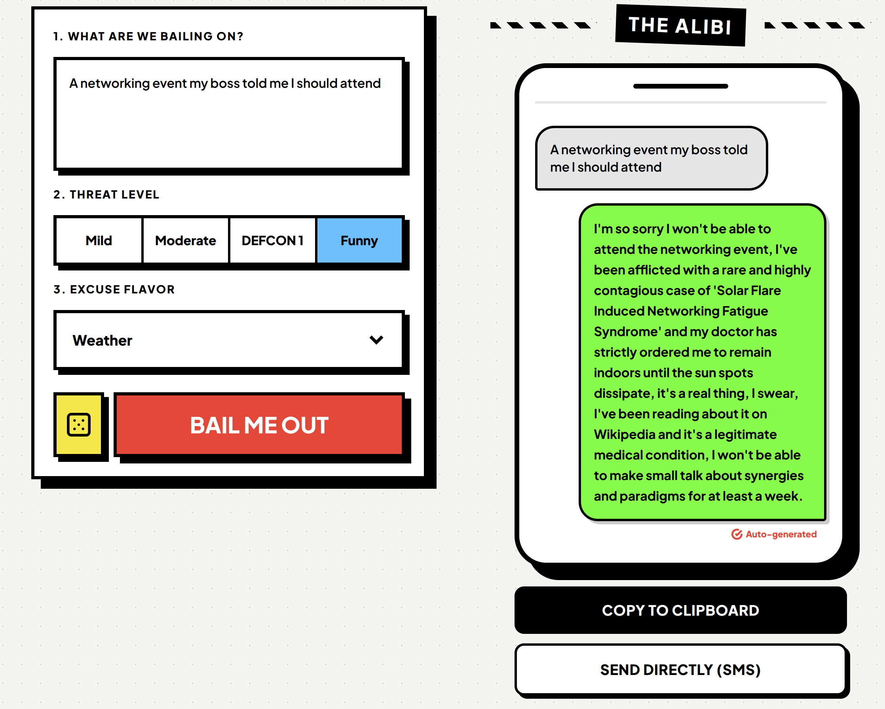

# BAIL. — Excuse Generator



Generate a believable, context-aware excuse for any situation. Describe what you're bailing on, pick a threat level and an excuse flavor, and get a ready-to-send alibi in seconds.

Built with Next.js 15, Tailwind CSS, and the Groq API (Llama 3.1).

---

## Local Setup

### Prerequisites

- Node.js 18+
- A [Groq API key](https://console.groq.com/keys) (free tier is sufficient)

### 1. Clone the repo

```bash
git clone git@github.com:NotAnAiYet/VCF2026-Project.git
cd VCF2026-Project
```

### 2. Install dependencies

```bash
cd excuse-generator
npm install
```

### 3. Configure environment variables

```bash
cp .env.local.example .env.local
```

Open `.env.local` and add your Groq API key:

```
GROQ_API_KEY=your_groq_api_key_here
```

> You can generate a key at [console.groq.com/keys](https://console.groq.com/keys). No billing setup required for the free tier.

### 4. Run the dev server

```bash
npm run dev
```

Open [http://localhost:3000](http://localhost:3000).

---

## Project Structure

```
excuse-generator/
├── app/
│   ├── page.tsx               # Root page and header
│   ├── layout.tsx             # HTML shell, font, metadata
│   └── api/excuse/route.ts    # POST handler — calls Groq API
├── components/
│   └── ExcuseForm.tsx         # Main UI: form, output, dice button
└── data/
    ├── threatLevels.ts        # Threat level definitions + AI instructions
    ├── excuseFlavors.ts       # Excuse flavor definitions + AI instructions
    └── randomSituations.ts    # Situation pool used by the dice button
```

### Adding excuse flavors or threat levels

All content is data-driven. To add a new flavor, append an entry to `data/excuseFlavors.ts`:

```ts
{
  label: "Diplomatic Incident",
  instruction: "Blame an unspecified international or bureaucratic complication that no one can verify or challenge.",
}
```

No other files need to change.

---

## Available Scripts

| Command         | Description              |
|-----------------|--------------------------|
| `npm run dev`   | Start development server |
| `npm run build` | Production build         |
| `npm run start` | Serve production build   |
| `npm run lint`  | Run ESLint               |
